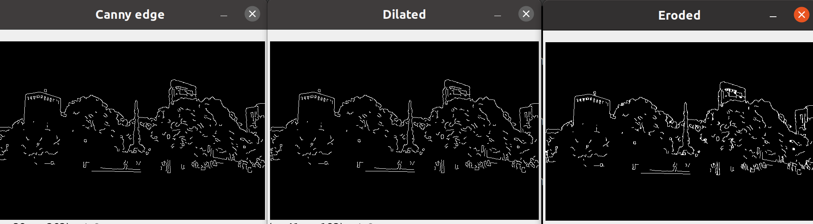
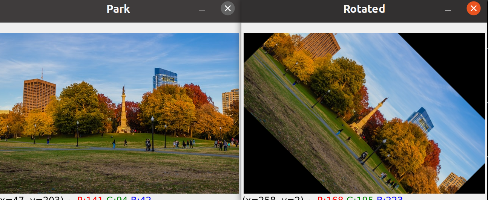
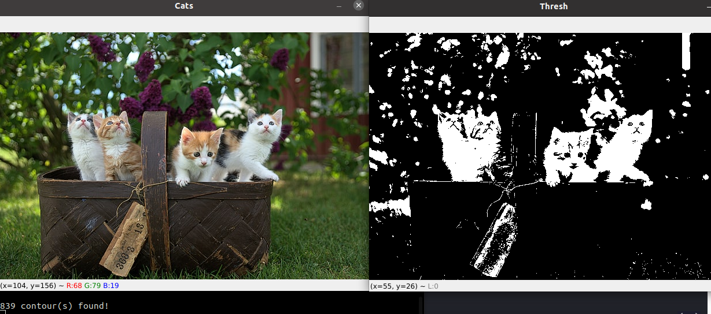

# Basic
1. [Importar librerías ](#schema1)

# 1 Read

2. [Cargar una foto](#schema2)
3. [Cargar un video](#schema3)
4. [Cerrar todas las ventanas](#schema4)

# 2 Rescale
5. [Crear función de redimensionar](#schema5)

# 3. Draw
6. [Pintar un cuadro negro](#schema6)
7. [Pintar un cuadro cualquier color](#schema7)
8. [Pintar un rectágulo](#schema8)
9. [Pintar un cículo](#schema9)
10. [Pintar una línea](#schem10)
11. [Pintar una línea](#schema11)

# 4. 5 Essential Functions in OpenCV
12. [Convertir a escala de grises](#schema12)
13. [Borroso y borde](#schema13)
14. [Dilating the image y Eroding](#schema14)
15. [Redimensionar y porción de imagen](#schema15)

# 5. Image Transformations
16. [Translación](#schema16)
17. [Rotación](#schema17)
18. [Girar](#schema18)

# 6. Contour Detection
19. [Convertimos a gray y buscamos los contornos](#schema19)
20. [Buscamos los contornos con la imagen borrosa](#schema20)
21. [Threshold](#schema21)
22. [Creamos un fondo negro](#schema22)

# 1. Importar librerías
En este curso vamos a usar la libreria `cv2`
~~~python
import cv2 as cv
~~~

# 2. Cargar una foto
Para cargar una foto vamos a usar la función `.imread()`, la mostraremos con `.imshow("titulo", archivo)` y cuando pulsemo el `0` con la función `.waitKey()`se parará el programa.
~~~python
img = cv.imread("./photos/cat_large.jpg")
cv.imshow("Cat", img)
cv.waitKey(0)
~~~

# 3. Cargar un video

La diferencia que hay con la lectura de un video es éste se lee frame a frame por eso hay que hacer un bucle.
~~~python
capture = cv.VideoCapture("./video/dog.mp4")

while True:
    isTrue, frame = capture.read()
    cv.imshow("video", frame)
    if cv.waitKey(20) & 0xFF == ord('d'):
        break
capture.release()
~~~

# 4. Cerrar todas las ventanas

~~~python
cv.destroyAllWindows()
~~~

## 5. Crear función de redimensionar
En esta función`rescaleFrame` hacemos una resescaldo de las imágenes y vídeos. Los vídeos tanto cargados como vídeos en directo.
~~~python
def rescaleFrame(frame, scale = 0.75):
    # images, videos and live video
    width = int(frame.shape[1] *scale)
    height = int(frame.shape[0] *scale)
    dimension = (width,height)
    return cv.resize(frame, dimension, interpolation = cv.INTER_AREA)

~~~
Con `changeRes` sólo podemos usarlo si son vídeos en directo.
~~~python
def changeRes(width,height):
    #live video
    capture.set(3,width)
    capture.set(4,height)
~~~

# 6. Pintar un cuadro negro
~~~python
blank = np.zeros((500,500,3), dtype = "uint8")
cv. imshow("Blank",blank)
~~~

# 7. Pintar un cuadro cualquier color
~~~python
blank[:] = 0,255,0 #green
cv.imshow("Green",blank)
~~~

# 8. Pintar un rectágulo
Con `cv.rectangle(objet, origin,size, line thickness` pintamos rectágulos
~~~python
cv.rectangle(blank,(0,0), (250,250),(0,255,0), thickness = 3 )
cv.imshow("Rectangle",blank )
~~~

Con `thickness = cv.FILLED` rellenemos el rectágulo, también vale `thickness = -1`
~~~python
#Rectagle filled
cv.rectangle(blank,(0,0), (250,250),(0,255,0), thickness = cv.FILLED ) # same thickness = -1
cv.imshow("Rectangle Filled",blank )
~~~

# 9. Pintar un cículo

Con `cv.circle(objet, origin,size, line thickness)`
~~~python

cv.circle(blank, (blank.shape[1]//2, blank.shape[0]//2),40, (0,0,250),thickness = -1)
cv.imshow("circle",blank)
~~~

# 10. Pintar una línea

~~~python

cv.line(blank, (0,0),(blank.shape[1]//2, blank.shape[0]//2), (255,255,255),thickness = 3)
cv.imshow("line",blank)
~~~

# 11. Pintar una línea

~~~python
cv.putText(blank,"Hello",(225,225),cv.FONT_HERSHEY_TRIPLEX, 1.0,(0,255,0),2)
cv.imshow("text", blank)
~~~

# 12. Convertir a escala de grises
~~~python
gray = cv.cvtColor(img, cv.COLOR_BGR2GRAY)
cv.imshow("Gray", gray)
~~~

# 13. Borroso y borde
`(5,5)' nivel de borroso
~~~python
blur = cv.GaussianBlur(img, (5,5),cv.BORDER_DEFAULT)
cv.imshow("Blur", blur)
~~~

~~~python
canny = cv.Canny(img, 125,175)
cv.imshow("Canny edge", canny)
~~~

Para ver mejor el borde de las cosas ponemos en vez de la imagen original ponemos la borros
~~~python
canny = cv.Canny(blur, 125,175)
cv.imshow("Canny edge", canny)
~~~

# 14. Dilating the image and Eroding

~~~python
dilated = cv.dilate(canny, (7,7), iterations = 3)
cv.imshow("Dilated", canny)
~~~

~~~python
eroded = cv.erode(dilated, (7,7), iterations = 3)
cv.imshow("Eroded", eroded)
~~~

# 15. Redimensionar y porción de imagen
~~~python
resize = cv.resize(img, (1000,1000))
cv.imshow("Resize", resize)
~~~

~~~python
crope = img[50:200, 200:400]
cv.imshow("Crope",crope)
~~~

# 16. Translación
Para hacer una translación de una imagen hay que crear una función que haga ese proceso. 
Moviendo la imagen por los ejes x e y.
~~~python
def translate(img, x,y):
    transMat = np.float32([[1,0,x],[0,1,y]])
    dimensions = (img.shape[1], img.shape[0])
    return cv.warpAffine(img, transMat, dimensions)
# -x --> Left
# -y --> Up
# x --> Right
# y --> Down
translated = translate(img,100,100)
cv.imshow("Translated", translated)
~~~

# 17. Rotación
~~~python
def rotate(img, angle, rotPoint=None):
    (height,width) = img.shape[:2]

    if rotPoint is None:
        rotPoint = (width//2,height//2)
    
    rotMat = cv.getRotationMatrix2D(rotPoint, angle, 1.0)
    dimensions = (width,height)

    return cv.warpAffine(img, rotMat, dimensions)

rotated = rotate(img, -45)
cv.imshow('Rotated', rotated)
~~~

# 18. Girar

~~~python
flip = cv.flip(img, 0)
flip1 = cv.flip(img,1) #mirror
cv.imshow("Flip", flip1)
~~~

# 19. Convertimos a gray y buscamos los contornos
~~~python
canny = cv.Canny(img, 125,175)
cv.imshow("Canny", canny)

#finf contourns
contours, hierarchies = cv.findContours(canny, cv.RETR_LIST, cv.CHAIN_APPROX_SIMPLE)
print(f'{len(contours)} contour(s) found!')
~~~

# 20. Buscamos los contornos con la imagen borrosa
~~~python
blur = cv.GaussianBlur(gray, (5,5), cv.BORDER_DEFAULT)
cv.imshow("Blur", gray)

canny = cv.Canny(blur, 125,175)
#cv.imshow("Canny", canny)

#finf contourns
contours, hierarchies = cv.findContours(canny, cv.RETR_LIST, cv.CHAIN_APPROX_SIMPLE)
print(f'{len(contours)} contour(s) found!')

~~~

# 21. Threshold
~~~python
ret, thresh = cv.threshold(gray, 125, 255, cv.THRESH_BINARY)
cv.imshow('Thresh', thresh)

#finf contourns
contours, hierarchies = cv.findContours(thresh, cv.RETR_LIST, cv.CHAIN_APPROX_SIMPLE)
print(f'{len(contours)} contour(s) found!')

~~~

# 22. Creamos un fondo negro
~~~python
blank = np.zeros(img.shape, dtype='uint8')
cv.imshow('Blank', blank)

cv.drawContours(blank, contours, -1, (0,0,255),2)
cv.imshow("Contours Drawn", blank)

~~~

Conclusión la mejor opción es buscar los contornos con la imagen borrosa. 
